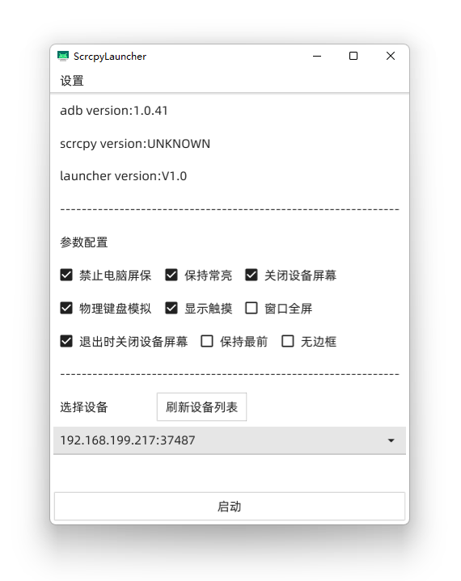

## ScrcpyLauncher
一个 [Scrcpy](https://github.com/Genymobile/scrcpy) 快捷启动器

go 语言 + fyne 框架实现, windows + linux 通用

## 特性
- go + fyne 实现, 支持 windows / linux
- 支持选择多个设备中的一个
- 支持大部分 scrcpy 参数配置
- 支持自定义 adb 和 scrcpy 位置

## 安装

使用如下命令编译并且安装

```shell
git clone https://github.com/Ericwyn/ScrcypLauncher.git
cd ScrcypLauncher
go mod tidy

# windows 请使用 build.bat
sh build.sh

```

编译得到的运行文件会在 `build-target` 文件夹内

因为项目所用 GUI 框架为 FYNE

所以编译和运行过程中如果遇到问题可参考 [Fyne:Getting Start](https://developer.fyne.io/started/) 及 [Fyne: Github Issue](https://github.com/fyne-io/fyne/issues)

## 截图
